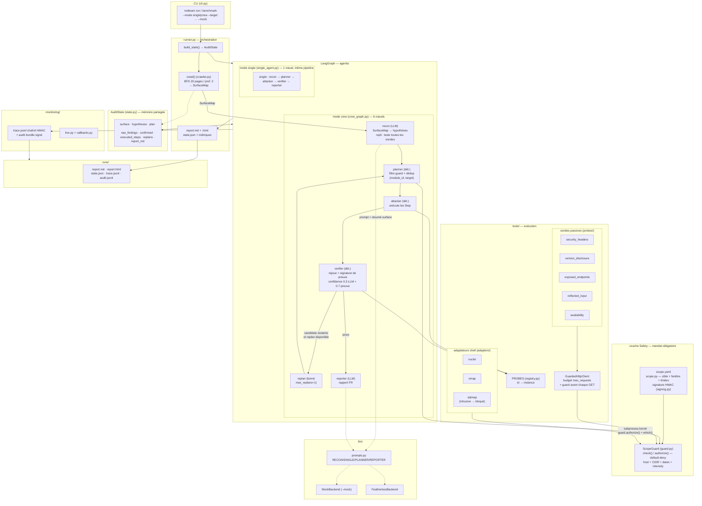

# Architecture — schéma et principes

Source : `src/redteam/` (lecture des fichiers `runner.py`, `crew_graph.py`, `single_agent.py`,
`nodes.py`, `state.py`, `registry.py`, `guard.py`, `crawler.py`).

## Schéma global



## Les 3 principes clés

1. **Couche Safety englobante** : `ScopeGuard` requis par le planner (filtre d'étapes),
   le `GuardedHttpClient` (chaque GET) et les adaptateurs (`authorize()` avant tout
   `subprocess`) — **default-deny** partout, scope scellé HMAC.
2. **LLM ≠ exécution** : `recon`/`reporter` raisonnent via prompts ; `planner`/`attacker`/
   `verifier` sont déterministes. **Aucune finding confirmée sans rejeu** (signature
   `(module_id, target, title)`), confidence = 0,3·LLM + 0,7·preuve.
3. **`AuditState` central** : dictionnaire LangGraph lu/écrit par tous les nœuds ; le mode
   `single` réutilise les **mêmes fonctions de nœuds**, seule l'orchestration diffère
   (1 passe vs boucle replan bornée à 1).

## Détails des nœuds (`agents/nodes.py`)

| Nœud | Type | Rôle |
|---|---|---|
| `recon_node` | LLM | `SurfaceMap` résumée → JSON d'hypothèses `{probe_id, target, rationale}` ; **repli** : si parsing vide → toutes les sondes du registre (raison `"repli"`). |
| `planner_node` | déterministe | Filtre `guard.check(target, intensity)` + anti-rejeu sur `executed_steps` → `plan: list[Step]`. |
| `attacker_node` | déterministe | `probe.run(client_factory(intensity), target)` par étape, trace `tool_call`, collecte `raw_findings`. |
| `verifier_node` | déterministe | Regroupe par `(module_id, target)`, **rejoue chaque sonde une fois**, confirme si signature réapparaît ; `confidence = 0.3·1.0 + 0.7·preuve`. |
| `replan_node` | - | Incrémente `replans` + trace `strategy_change`; routage borné `max_replans`. |
| `reporter_node` | LLM | Rapport FR factuel depuis les findings confirmés uniquement. |

## Cycles du graphe crew (`crew_graph.py`)

```
START → recon → planner → attacker → verifier ─┬─(raw_findings ≠ ∅ ET replans < max)→ replan → planner
                                               └─(sinon)→ reporter → END
```
`recursion_limit: 25` (crew) / `10` (single) — filet anti-boucle infinie.

## Pipeline d'exécution (`runner.py`)

```
build_state → (si surface absente) crawl PASSIVE → graphe → metrics_from_trace
            → report.md / report.html / state.json
```
`client_factory(intensity)` fabrique un `GuardedHttpClient` adéquat (scope, budget,
transport injectable pour les tests).
