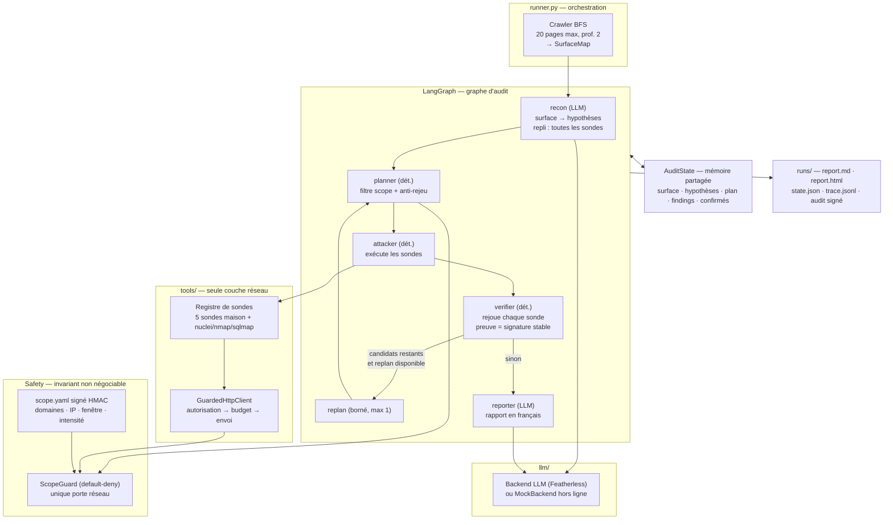

# Dossier de rendu — Red Team IA (PoC)

> Dossier destiné au **jury du hackathon Neoloji Technopole — Grand Poitiers × École 42
> Angoulême (porté par DPLIANCE)**. Il présente le fonctionnement du PoC, ses résultats de
> benchmark et l'expérimentation menée sur le choix du modèle LLM.
> La documentation technique détaillée reste dans [`ARCHITECTURE.md`](ARCHITECTURE.md) et
> [`METHODOLOGIE.md`](METHODOLOGIE.md).

---

## 1. Présentation

**Red Team IA** est un auditeur cybersécurité pensé nativement autour de l'IA. Il explore une
cible **autorisée**, en cartographie la surface, adapte sa stratégie selon ses observations,
recherche des faiblesses, puis **vérifie chaque hypothèse par une preuve reproductible** avant
de produire un rapport.

**Principe directeur :** le LLM raisonne, priorise et rédige. Les outils déterministes
observent et prouvent. **Aucune vulnérabilité n'est retenue sans preuve reproductible.**

**Cadre d'autorisation** (non négociable) :

- usage strictement réservé aux cibles autorisées par DPLIANCE (la copie **Mirage** fournie
  pour le hackathon) ;
- périmètre décrit dans un **scope signé HMAC** (`scope.yaml`), rejeté en cas d'altération ;
- **`ScopeGuard`** (politique *default-deny*) : domaines/IP, exclusions, fenêtre temporelle,
  plafond d'intensité — hors périmètre = refus ;
- journal d'**audit chaîné SHA-256**, ancré par un checkpoint signé : preuve de ce que l'IA a
  réellement fait.

---

## 2. Architecture

### 2.1 Vue en flux

### 2.2 Les trois principes

| Principe | Ce que ça donne |
|---|---|
| **Sûreté par construction** | Tout chemin réseau passe par le `ScopeGuard` (scope signé HMAC, *default-deny*, budget de requêtes, intensité bornée). Aucun contournement possible. |
| **Le LLM n'exécute rien** | Les nœuds `recon`/`reporter` raisonnent via prompts ; `planner`, `attacker`, `verifier` sont **déterministes**. Les agents proposent, les outils exécutent. |
| **Preuve reproductible** | Le `verifier` **rejoue** chaque sonde et ne confirme un finding que si sa signature `(module_id, cible, titre)` réapparaît. Confidence = 0,3 · avis LLM + 0,7 · preuve observée. |

### 2.3 Les deux modes d'exécution

| | Mode `crew` | Mode `single` |
|---|---|---|
| Shape | Graphe multi-agents : recon → planner → attacker → verifier → (replan →) reporter | Un seul agent généraliste enchaînant les mêmes 5 étapes |
| Adaptativité | Boucle de **replanification bornée** (`max_replans = 1`) | Aucune — une seule passe |
| Objectif | Répondre à la question « les agents spécialisés valent-ils mieux qu'un généraliste ? » | Référence comparable (mêmes outils, même verifier, même scope) |

### 2.4 Ce qui est mesuré à chaque run

Tout est tracé (`trace.jsonl`) et reconverti en métriques (`RunMetrics`) : durée, appels LLM,
tokens (proxy de coût), appels d'outils, findings **confirmés** vs **écartés**, replans, erreurs.
La **qualité** compare les modules confirmés à une **vérité terrain** figée
(`eval/mirage_ground_truth.yaml`) : précision / rappel / F1.

---

## 3. Benchmarks : pourquoi, comment, et y a-t-il intérêt ?

### 3.1 Pourquoi benchmarker

Un choix d'architecture ou de modèle LLM, non mesuré, reste une **opinion**. Le benchmark sert
à transformer deux questions en données :

1. **Multi-agents (`crew`) vs mono-agent (`single`)** : le même audit, deux orchestrations ;
2. **Choix du modèle LLM** : voir la section 4.

**Méthode** : même cible (`hackathon.mirage-analytics.com`), même scope signé, même vérité
terrain, traces converties par `benchmark/metrics.py` → tableau comparatif
(`benchmark/compare.py`) + score F1.

### 3.2 Résultats — baseline Huihui-Qwen3.8-27B-abliterated

*(source : `runs/benchmark-huihui.md`)*

| run | mode | durée | tool_calls | confirmés | écartés | replans | précision | rappel | F1 |
|---|---|---|---|---|---|---|---|---|---|
| `082618` | single | 1296 s | 13 | 19 | 1 | 0 | 0.40 | 0.67 | **0.50** |
| `084754` | crew  | 1058 s | 18 | 18 | 1 | 1 | 0.40 | 0.67 | **0.50** |

### 3.3 Résultats — modèle OBLITERATUS/Qwen3.8-27B

*(source : `runs/benchmark-obliteratus.md`)*

| run | mode | durée | tool_calls | confirmés | écartés | replans | précision | rappel | F1 |
|---|---|---|---|---|---|---|---|---|---|
| `093445` | single | 1014 s | 7 | 10 | 3 | 0 | 0.50 | 0.67 | **0.57** |
| `095139` | crew  | 360 s  | 5 | 3  | 0 | 1 | 0.67 | 0.67 | **0.67** |

### 3.4 Verdict : y a-t-il intérêt au mode `crew` ?

**Oui, mais pas pour la raison intuitive.**

- **Qualité** : le `crew` atteint le meilleur F1 observé (**0.67** vs 0.57 en `single`, et
  0.50/0.50 sur la baseline). Il **sélectionne mieux** : 0 faux positif confirmé contre 3 pour
  `single` (précision 0.67 vs 0.50).
- **Quantité** : il trouve *moins* de findings bruts (3 vs 10). Le gain n'est pas « plus de
  vulns » mais **« moins de bruit »** — précision 0.67 vs 0.50.
- **Rapidité** : 360 s contre 1014 s (**×2.8**) — le planner déterministe filtre tôt, le
  LLM est appelé 2 fois dans les deux modes.
- **Autonomie** : une replanification a effectivement eu lieu (`replans = 1`) — la boucle
  d'adaptation fonctionne.

**Conclusion honnête** : le `crew` paie son supplément d'orchestration par une meilleure
sélection et un run plus court, au prix d'un rappel non amélioré (0.67 partout, borné par le
registre de sondes — pas par l'orchestration). **Caveat méthodologique affiché : 1 run par
cellule** — c'est une tendance solide à confirmer, pas une preuve statistique.

---

## 4. Expérimentation Q2 : l'impact du choix du modèle LLM

### 4.1 La question

Le modèle LLM est un composant interchangeable du PoC : peut-on **mesurer** son impact sur la
qualité, le coût et la latence d'un audit — sans toucher au code ?

### 4.2 Le dispositif

Le modèle se permute par la **variable `REDTEAM_MODEL`** (`.env`), sans modification de code ;
un catalogue de modèles par rôle (`llm/models.py`) est prévu pour aller plus loin. Les deux
modèles ont été évalués sur **exactement le même scénario** : même cible, même scope signé,
même vérité terrain, mêmes deux modes `single` et `crew`.

| | `huihui-ai/Huihui-Qwen3.8-27B-abliterated` | `OBLITERATUS/Qwen3.8-27B-OBLITERATED` |
|---|---|---|
| Rôle | Modèle initial (baseline) | Alternative testée |
| Source | `runs/benchmark-huihui.md` | `runs/benchmark-obliteratus.md` |

### 4.3 Résultats

**Latence et coût** (événements `llm_call` agrégés, source : `runs/comparaison-modeles.md`) :

| métrique | Huihui | OBLITERATUS | écart |
|---|---|---|---|
| Latence moyenne par appel | **52,8 s** | **7,7 s** | ×6,9 plus rapide |
| Latence max | 115,7 s | 10,2 s | — |
| Tokens de sortie (4 appels) | 7531 | 594 | ×12,7 moins verbeux |
| Tokens d'entrée (4 appels) | 2148 | 1643 | −24 % |

**Qualité des audits** :

| métrique | Huihui | OBLITERATUS |
|---|---|---|
| F1 `single` | 0.50 | **0.57** |
| F1 `crew` | 0.50 | **0.67** |
| Durée `crew` | 1058 s | **360 s** |

### 4.4 Lecture

1. **Le modèle est un levier mesurable.** Un changement de variable d'environnement a fait
   passer la latence moyenne de 52,8 s à 7,7 s (×6,9) et réduit de 13× les tokens de sortie,
   sans aucune ligne de code modifiée.
2. **Le choix du modèle impacte aussi la qualité** : le F1 passe de 0.50 à 0.67 (mode `crew`)
   — un modèle plus concis formule mieux ses hypothèses de recon.
3. **La valeur de l'infrastructure** : c'est le benchmark qui a transformé « le modèle initial
   semble lent » en mesure objective. Sans traces et sans vérité terrain, ce choix serait
   resté une intuition.

**Limite assumée** : n = 1 run par cellule ; l'écart de latence est massif et robuste, l'écart
de F1 est une tendance à consolider par des runs supplémentaires.

---

## 5. Pistes d'amélioration

- **Enrichir le registre de sondes** — le rappel (0.67) est plafonné par les sondes
  disponibles, pas par l'orchestration ; l'ajout est mécanique.
- **Consolider les benchmarks** — répéter chaque cellule pour transformer les tendances en
  résultats statistiques ; brancher le `MODEL_CATALOG` par rôle.
- **Backend LLM local** (Ollama/vLLM) — supprimer la dépendance à l'API distante et comparer
  qualité ↔ coût ↔ latence.
- **Relever bornes d'autonomie** (`max_replans`, intensité) — arbitrage à mener **avec le
  mandant**, jamais par défaut.
- **Confinement réseau des outils externes** (namespace limité à l'hôte autorisé).

---

## Annexes

| Ressource | Lien |
|---|---|
| Architecture technique | [`ARCHITECTURE.md`](ARCHITECTURE.md) |
| Méthodologie et réponses aux 5 questions | [`METHODOLOGIE.md`](METHODOLOGIE.md) |
| Résultats bruts (baseline) | [`../runs/benchmark-huihui.md`](../runs/benchmark-huihui.md) |
| Résultats bruts (OBLITERATUS) | [`../runs/benchmark-obliteratus.md`](../runs/benchmark-obliteratus.md) |
| Comparaison des modèles | [`../runs/comparaison-modeles.md`](../runs/comparaison-modeles.md) |
| Vérité terrain | [`../eval/mirage_ground_truth.yaml`](../eval/mirage_ground_truth.yaml) |
